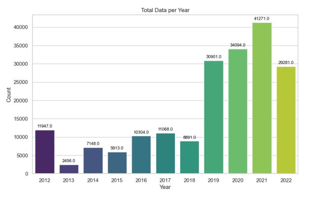
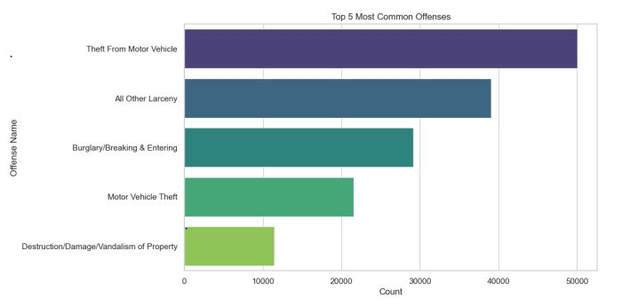
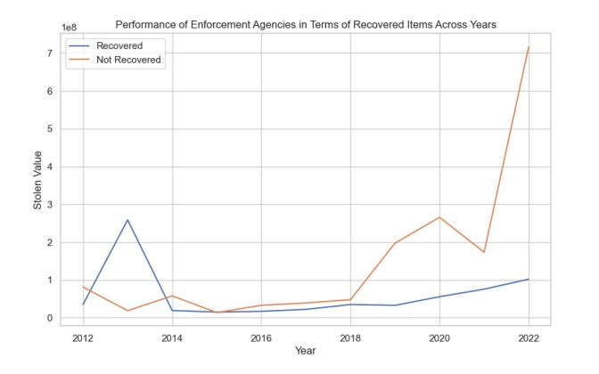
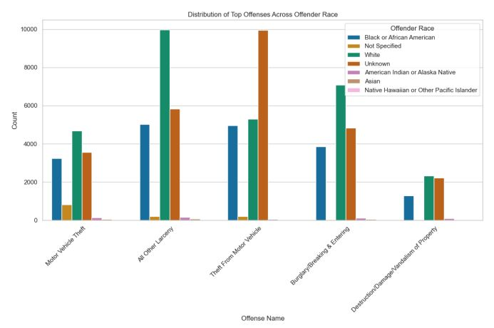
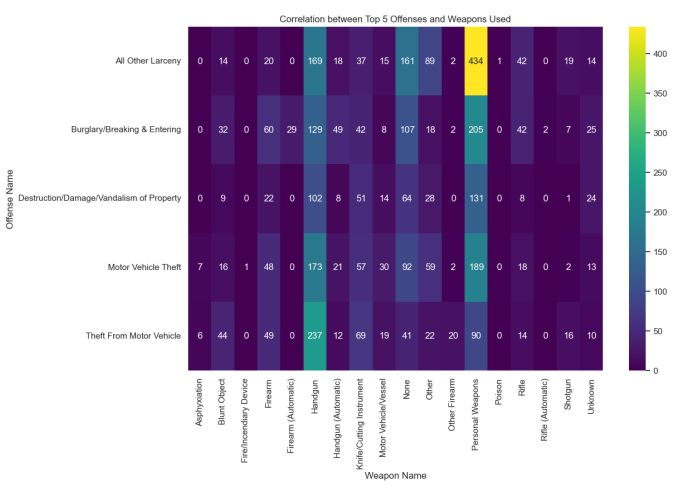
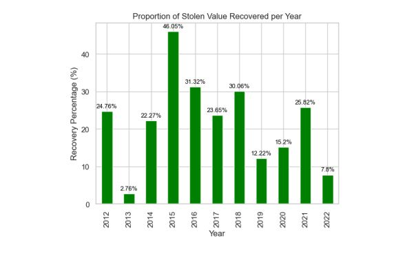

<h1 align="center">Exploratory Data Analysis of Cargo Theft Data</h1>

<h4 align="center">Uncovering Effective Crime Prevention Strategies</h4>

 

<h2>Objective</h2>

Cargo theft is defined as “the criminal taking of any cargo.” This includes actual physical theft as well as cyber theft and documentation fraud, which is the altering of the ownership, destination, or contents of a cargo shipment. - <a href="https://cde.ucr.cjis.gov/LATEST/webapp/#/pages/downloads" target="_blank">Federal Bureau of Investigation.</a> The objective of this repository is to perform an in-depth exploratory data analysis on cargo theft data. The aim is to identify patterns and propose viable strategies for the prevention of such incidents.

<h2>Data</h2>

The dataset as well as the description can be found on <a href="https://cde.ucr.cjis.gov/LATEST/webapp/#/pages/home" target="_blank">FBI Crime Data Explorer Website</a>

<h2>Observations</h2>

The data contains approximately 193 thousand records of cargo thefts spanning from 2012 to 2022, with the peak incidence occurring in 2021, totaling 41 thousand thefts. An intriguing observation prompts the need for a more detailed examination: the notable surge in crime rates observed between 2018 and 2019. Further investigation into this specific timeframe could yield valuable insights into the factors contributing to this sudden escalation in cargo theft incidents.

<h3>Other insights gained from the data are</h3>

- 
The most common type of offense committed is theft from motor vehicle.
 

- 
The trend below reveals a concerning pattern where the number of recovered items consistently decreases, juxtaposed with a significant and alarming increase in the count of unrecovered items.
 

- 
Individuals identified as White have been involved in a higher number of crimes compared to those identified as Black across all the major categories of top offenses.
 

- 
 Another crucial observation is that people who commit crimes tend to use Handgun and Personal Weapons.
 

- 
In 2015, law enforcement agencies achieved their highest level of success in terms of the value of recovered items.
 
